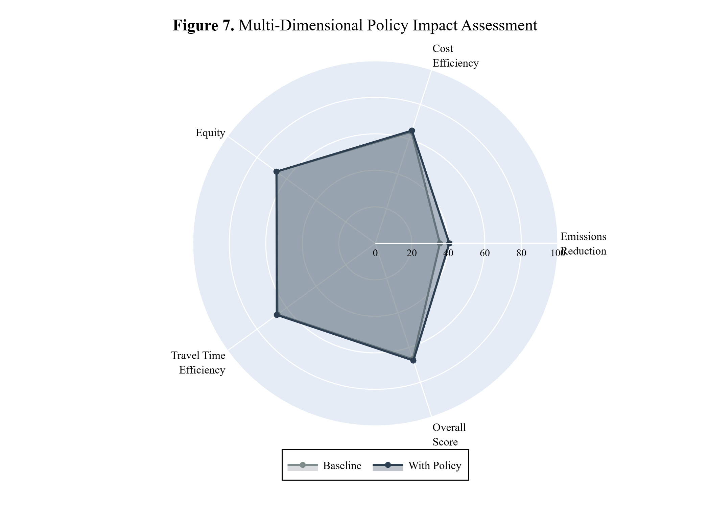

# PolicySim-AI

## Transportation Policy Simulation & Analysis Tool

[](https://python.org)
[](https://streamlit.io)
[](LICENSE)

**PolicySim-AI** is an open-source, research-grade agentic AI system that simulates and explains transportation policy impacts using transparent mathematical models and open-source language models.



---

## 🎯 Overview

PolicySim-AI helps researchers and planners **systematically evaluate transportation policies** by:

1. **Simulating policy impacts** using transparent mathematical models (emissions, costs, equity, efficiency)
2. **Comparing multiple policy scenarios** in a structured and reproducible way
3. **Using open-source AI** (Llama 3 via Groq) to explain results in plain language

### What Makes This "Agentic AI"?

The system behaves like an agent because it:
- Understands policy scenarios from natural language
- Decides which evaluation models to apply
- Runs simulations step-by-step
- Explains trade-offs between policies

**All logic is explicit and inspectable**, not hidden in prompts.

---

## 📦 Features

| Feature | Description |
|---------|-------------|
| 🔬 **Transparent Models** | All calculations are explicit and documented |
| 🤖 **AI Explanations** | Open-source LLM explains results in plain language |
| 📊 **Interactive Visualizations** | Plotly charts for exploring results |
| 📋 **Pre-built Scenarios** | Ready-to-use policy combinations |
| 🌍 **Regional Contexts** | Support for different countries/regions |
| 📄 **Publication-Ready Figures** | High-resolution exports for papers |
| 💬 **Natural Language Interface** | Ask questions in plain English |

---

## 🚀 Quick Start

### Prerequisites

- Python 3.9 or higher
- Groq API key (free at [console.groq.com](https://console.groq.com))

### Installation
```bash
# Clone the repository
git clone https://github.com/mahbubchula/PolicySim-AI.git
cd PolicySim-AI

# Create virtual environment
python -m venv venv

# Activate virtual environment
# Windows:
venv\Scripts\activate
# Mac/Linux:
source venv/bin/activate

# Install dependencies
pip install -r requirements.txt
```

### Configuration

Create a `.env` file in the project root:
```
GROQ_API_KEY=your_groq_api_key_here
```

### Run the Application
```bash
streamlit run app.py
```

Open your browser to `http://localhost:8501`

---

## 📖 Documentation

- [User Manual](USER_MANUAL.md) - Complete usage guide
- [Methodology](docs/METHODOLOGY.md) - Model documentation
- [API Reference](docs/API.md) - For developers

---

## 🔬 Available Policies

| Policy | Description | Key Parameters |
|--------|-------------|----------------|
| **Congestion Pricing** | Charges for driving in congested areas | Price per entry, peak multiplier |
| **Public Transit Subsidy** | Reduces transit fares through subsidies | Subsidy percentage |
| **Fuel Tax** | Additional tax on fuel | Tax percentage |
| **EV Incentive** | Subsidies for electric vehicles | Purchase subsidy |
| **Parking Management** | Parking pricing and restrictions | Hourly rate |

---

## 📊 Simulation Models

### Emissions Model
```
CO₂ = Σ(trips_by_mode × avg_distance × emission_factor)
```

### Cost-Benefit Model
```
User Cost = fuel_cost + fare + (travel_time × value_of_time)
```

### Equity Model
```
Burden = (transport_cost / income) × 100 by income quintile
Equity Score = 1 - Gini coefficient
```

### Mode Share Model
```
ΔQ/Q = elasticity × ΔP/P
```

---

## 📁 Project Structure
```
PolicySim-AI/
├── app.py                    # Main Streamlit application
├── config.py                 # Configuration and settings
├── models.py                 # Simulation models
├── policies.py               # Policy definitions
├── agent.py                  # Agentic AI orchestrator
├── llm_helper.py             # LLM integration (Groq)
├── visualizations.py         # Interactive charts
├── publication_figures.py    # Publication-grade exports
├── requirements.txt          # Dependencies
├── .env                      # API keys (not in repo)
├── README.md                 # This file
├── USER_MANUAL.md            # User documentation
└── publication_figures/      # Generated figures
```

---

## 📄 Citation

If you use PolicySim-AI in your research, please cite:
```bibtex
@software{policysim_ai_2024,
  author = {MAHBUB},
  title = {PolicySim-AI: An Agentic AI System for Transportation Policy Simulation},
  year = {2024},
  url = {https://github.com/yourusername/PolicySim-AI}
}
```

---

## 📚 References

1. IPCC Guidelines for National Greenhouse Gas Inventories
2. World Bank Transport Cost Guidelines
3. Litman, T. (2022). Evaluating Transportation Equity
4. Small, K.A. & Verhoef, E.T. (2007). Economics of Urban Transportation
5. Highway Capacity Manual (HCM)

---

## 📝 License

This project is licensed under the MIT License - see the [LICENSE](LICENSE) file for details.

---

## 🤝 Contributing

Contributions are welcome! Please read our [Contributing Guidelines](CONTRIBUTING.md) before submitting a pull request.

---

## 📧 Contact

- **Author**: Mahbub Hassan, Founder: B'deshi Emerging Reseacrh Lab & Non Asean Scholar, Chulalongkorn University, Thailand 
- **Email**: mahbub.hassan@ieee.org
- **GitHub**: https://github.com/mahbubchula

---

*Built with ❤️ for transportation research*
